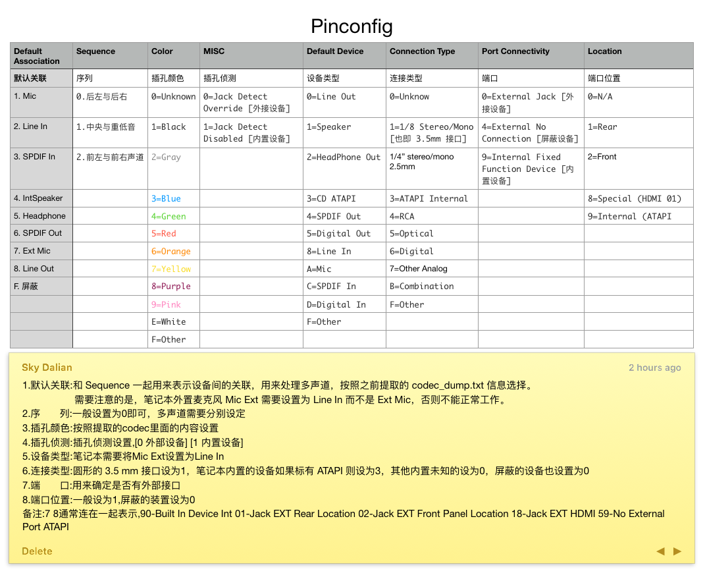
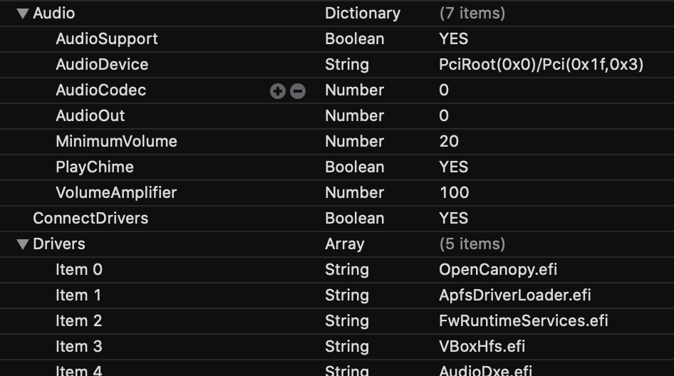
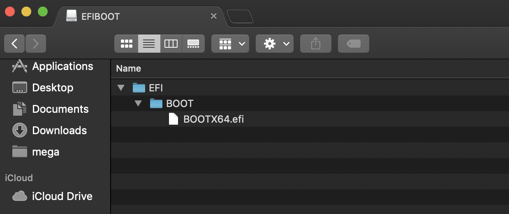

# 介绍
 &emsp;&emsp;xps9570 clover/oc 开发记录
# 硬件配置
## 已驱动
* Machine :Dell XPS 9570
* CPU: Intel i7-8750H
* GPU: UHD630 
* RAM: 16GB RAM
* Display: 4K Sharp Display
* SSD: SM961
* Audio: Realtek ALC3266
* WLAN + Bluetooth : apple 原生网卡
## 未驱动
* Goodix fingerpint reader (bios关闭)  
* sd-card(bios关闭)
* touch panel(bios关闭)
* Nvidia Gefore 1050Ti(bios断电关闭)
# 开发记录
## I2C
### CLOVER
&emsp;&emsp;I2C会导致很高的kernel task占用，我有一种感觉这个是最后需要解决的问题
I2C 两条线路是I2C1 于I2C0  
这两个线路分别是I2C1 的TPD0触摸板和I2C0 的TPL1的触摸屏
TPD0的为APIC 轮询pin:0x33  
TPL1的为APIC 轮询pin:0x3b  
实际上大于0x2F的就是无法使用APIC 中断了
所以正确的做法是改为GPIO中断
&emsp;&emsp;附上代码

 		Method (_CRS, 0, NotSerialized)          {
           Name (SBFB, ResourceTemplate ()
            {
                I2cSerialBusV2 (0x002C, ControllerInitiated, 0x00061A80,
                    AddressingMode7Bit, "\\_SB.PCI0.I2C1",
                    0x00, ResourceConsumer, _Y40, Exclusive,
                    )
            })

            
  
            Name (SBFG, ResourceTemplate ()
            {
                GpioInt (Level, ActiveLow, ExclusiveAndWake, PullDefault, 0x0000,
                    "\\_SB.PCI0.GPI0", 0x00, ResourceConsumer, ,
                    )
                    {   // Pin list
                        
                        0x009e
                    }
            })
       
            Return (ConcatenateResTemplate (SBFB,SBFG))
        }

&emsp;&emsp;并且将返回值的SBFI置换为SBFG，因为默认是0x17中断，但是实际上要用0x9E中断或者0x1b中断，实测下来kernel task稳定在11%。即使是在快速长久触发GPIO中断下的触摸板时
&emsp;&emsp;TPL1触摸屏同理
------
&emsp;&emsp;dell是双驱动模式的PS2M 和TPL TPD 还有多余的一组TPL和TPD我想是这些影响了高kernel task  
### OPENCORE(预留以后填坑)
# APPLEALC开发记录
&emsp;&emsp;很多CLOVER建议是用30或者72的点
查询源码得知
分别为layout——id为ALC298的点是  
3，11，13，21，22，28，29，30，47，66，72，99  
30是Constanta - Realtek ALC298 for Xiaomi Mi Notebook Air 13.3 Fingerprint 2018  
72是Custom - Realtek ALC298 for Dell XPS 9560 by KNNSpeed  
&emsp;&emsp;显然72更适合xps9570，为什么有些人会觉得72不适合或者30不适合  
让我们查看源代码  
<01271c30 01271d00 01271ea0 01271f90    
 01771c40 01771d00 01771e17 01771f90 01770c02 (EPAD)  
 01871c70 01871d10 01871e81 01871f00  
 02171c20 02171d10 02171e21 02171f00>  
&emsp;&emsp;layout=30:  
&emsp;&emsp;首先是0x17为内置speaker输出 01170c02是EAPD的参数，看起来十分好但是0x18的是70108100这个是

&emsp;&emsp;是外置输入mic，black linein输入3.5mm接口  
实际上是正确的，但是他的GPIOmute是错误的
应该是0x50010018的10进制。实际加入后并无效果
layout=72:  
<01271c10 01271d01 01271ea6 01271f90  
01771c20 01771d01 01771e17 01771f90  
01871c30 01871d10 01871eab 01871f03  
01a71c40 01a71d10 01a71e8b 01a71f03  
02171c50 02171d10 02171e2b 02171f03 01470c02 01770c02 01a70c02 02170c02>  
0x18的是完全错误的，但是节点没有0x18的节点，输入定义了但是没有给节点
&emsp;&emsp;所以我的思路是对0x18驱动对0x1a屏蔽，也就是分别为0x17内置扬声器
0x21耳机输出，0x18外置mic输入，0x12内置mic驱动，其余屏蔽
实际看下来只有layout 为11的比较相似。或许layout 为11更好驱动一些
## 声路链路图(首发,转载请注明)
   
 
2019.8.24  
 新增layout 为32的点在applealc 试音新的applealc即可注入  
## opencore 开机duang设置
### 1在音频文件夹中找到REsource复制到oc目录中
### 2将AudioDxe.efi和OpenCanopy.efi复制到drivers文件夹中
### 3按下图设置
  
 注：  
 VolumeAmplifier: 1000  
音量在原有基础上放的百分比  
有效范围 0 ~ 1000   
MinimumVolume:  
输出最小音量, 有效值为 0 ~ 100  
# 耳机无声
&emsp;&emsp;使用HDEF来注入的话会导致外置mic无法驱动，但是不用的话又会导致耳机输出无声，使用alc298fix+辅助kext或许是导致耳机无mic输入的关键
注入点正确，但是不显示为外置，而依然是内置mic，怀疑是intel智音系统会自动将外置mic转为内置mic，在win10下也是无法通过3.5mm耳机孔来观看是否是外置还是内置，全部显示为外置，但是在linux下可以显示为外置。
注入点正确，但是不显示为外置，而依然是内置mic，怀疑是intel智音系统会自动将外置mic转为内置mic，在win10下也是无法通过3.5mm耳机孔来观看是否是外置还是内置，全部显示为外置，但是在linux下可以显示为外置。  
&emsp;&emsp;2019.8.24  
&emsp;&emsp;更正一些知识点macbookpro不能外置MIC只能用折中办法将line in来驱动，但是无奈xps15没有line in接口只有mic输入，所以无解。
# HDMI audio 开发记录
~~&emsp;&emsp;使用weg的手册，但是codec和connect-type均正确却无输出。原因未知~~  
~~&emsp;&emsp;尝试使用fakePCIID~~

~~&emsp;&emsp;原因是未检测到codec，所以hdef上无hdmi分支，但是在插入的话无法热启动。~~

~~&emsp;&emsp;尝试虚拟一个分支，或者伪造一个hdmi，尝试在applealc中添加核显hdmi控制器~~  
[发现大佬的oc可以完美HDMI音频热拔插](https://github.com/xxxzc/xps15-9570-macos "大佬")

# fan传感器
&emsp;&emsp;获取DSDT的不知道哪里的参数，伪造了个转速，实际原因是因为fan的储存位置不知，其次是如何控制，关于解锁EC可给出建议。但是EC写数据是非常危险的，很可能导致无法开机。 
## diy人士请看下面  
&emsp;&emsp;EC控制器猜测解锁的位置  
解锁:0x30a3  
上锁:0x34a3  
&emsp;&emsp;fan传感器更新:  
~~从EC中获取风扇传感器温度以及PCH温度 DIMM温度现已更新~~
未在catalina中测试  
[远景上的教程](http://bbs.pcbeta.com/viewthread-1826371-1-1.html)
# 关于解锁MSR和BIOS (附相关解锁位置)
&emsp;&emsp;反编译bios文件，后得到了所有部件的寄存器位置，在bios已经实现了显卡供电阻断，但是危险性较高。所以放出部分部件的寄存器位置，供大家解锁
[这里有很完整的教程](https://github.com/smallssnow/XPS9570-8570H-macos/issues/2) 
根据以上教程，总结如下  
## 1.制作一个启动盘
&emsp;&emsp;下载modGRUBShell.efi, 并重命名为bootx64.efi

&emsp;&emsp;在U盘内创建一个EFI文件夹，并再在此文件夹下创建文件夹BOOT，并将bootx64.efi放入BOOT下：
&emsp;&emsp; 
&emsp;&emsp;重启电脑，我们通过UEFI启动此U盘进入GRUB shell

## 2.寻找指令，解锁
&emsp;&emsp;setup_var_3 0x5C1 0x00
0x5C1是寄存器地址 
0x00是写入值

## 3.下方附带部分解锁位置(首发,转载请注明)
&emsp;&emsp;请注意更新bios不会覆盖大多位置，但是具体情况还是要具体分析

其实主要解锁CFG-LOCK即可  
 
| 名称 | 地址 | 写入值 | 备注
| :--- | :----: | ----: | ----: |
| CFG-LOCK | 0x5BD | 0x00(unlock)/0x01(lock) |  解锁E2寄存器 |
| Overclocking Lock    | 0x659    | 0x00(unlock)/0x01(lock)       | 超频锁 |
| PL1enable |0x5AB | 0x00(disable)/0x01(enable) | PL1功耗墙 |
|PL2 Enable |0x5B1| 0x00(disable)/0x01(enable) | PL2功耗墙 |
| DVMT Pre-Allocated | 0x8E6 |0x00(0m)/0x01(32m)/0x02(64m) | 0x03(undefined)请注意没有96m |
| TDP Lock |  0x5BF | 0x00(disable)/0x01(enable) | TDP热设计功耗墙 |
| DPTF | 0x39E | 0x00(disable)/0x01(enable) | CPU散热动态调节 |
|下面还未确认具体信息| dangerous&&No specific write value confirmed | ---- | ---- |
| FAN0 SPEED | 0x38A | 温度和转速设定的二元一次函数 0xF到0x77 | 风扇0转速 |
| FAN1 SPEED | 0x389 | 温度和转速设定的二元一次函数 0xF到0x77 | 风扇1转速 |
[更多信息点此](https://app.gitbook.com/@smallssnow/s/xps9570/) 
# 关于0.8ghz锁频  
  解锁EC风扇控制位，动态注入风扇控制  
  目前采用bios关闭DPTF解决此问题
# 超频技术 
[超频指南](./Overclock.md) 
实际上过于复杂，如果为了测试分数可以使用，但是实际用处不大，故废弃。如果您有更有效的变频请留下创意。附常规测试分数。
  
留坑记录优化过程
# 关于睡眠问题
[发现大佬的oc可以完美睡眠唤醒，且不用开盖后再按电源键唤醒，耗电更是低到每晚1%](https://github.com/xxxzc/xps15-9570-macos "大佬")
# 关于雷电三热拔插
&emsp;&emsp;特别渠道得到了xps9560的主板原理图，相信会从中发现破解端倪。 
 
# 关于降压
留坑
# 已知问题
- i2C驱动错误
- 雷电三热拔插 
# 鸣谢
* [Rehabman](https://github.com/RehabMan)
* [bavariancake](https://github.com/bavariancake/XPS9570-macOS)
* [LuletterSoul](https://github.com/LuletterSoul/Dell-XPS-15-9570-macOS-Mojave):深度整合了各种优良的EFI并且使用最新方法来完善，EFI几乎是完美的，本MD参考他的。

